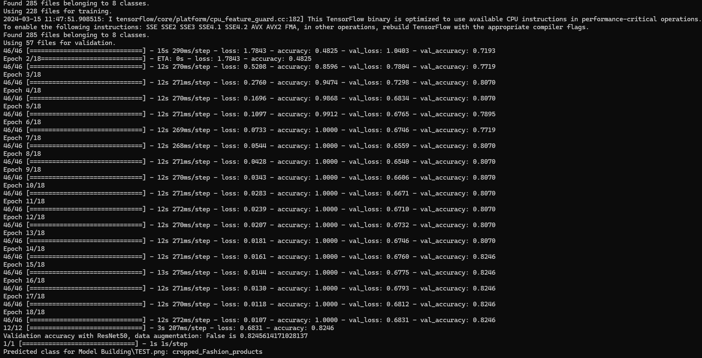

## Image Classifier for Slash Mobile Application

### Overview
This project aims to develop an image classifier for the Slash mobile application, utilizing transfer learning with the ResNet50 model. The workflow encompasses various stages, including data collection, preprocessing, model training, evaluation, and prediction.

### Approach
1. **Data Collection**: Screenshots are captured from the Slash mobile application using the provided `capture_and_organize_screenshots.bat` script. USB debugging is enabled on the Android device to facilitate this process.

2. **Image Processing**: The `ImageCropper.py` script implements advanced image processing techniques using OpenCV. The following steps are executed:
    - Grayscale Conversion: Screenshots are converted to grayscale to simplify subsequent processing steps.
    - Edge Detection: Canny edge detection is applied to identify prominent edges within the images.
    - Contour Detection: Contours of products within the screenshots are detected using OpenCV's contour detection algorithms.
    - Product Cropping: Products are accurately cropped from the screenshots based on the detected contours. This step ensures that individual product images are isolated for further analysis.

3. **Model Training**: The `ModelTrainer.py` script focuses on model training using transfer learning with the ResNet50 architecture. The following steps are involved:
    - Dataset Loading: Product images extracted from the screenshots are loaded from the `final_products_images` directory.
    - Dataset Preprocessing: Images are resized to the required input dimensions for the ResNet50 model, ensuring uniformity across the dataset.
    - Model Creation: A pre-trained ResNet50 model is instantiated with the appropriate input shape and number of output classes. The pre-trained weights are utilized as a starting point for the model.
    - Model Compilation: The model is compiled with suitable loss and optimizer functions to optimize training performance.
    - Model Training: The ResNet50 model is trained on the prepared dataset, with hyperparameters such as batch size, number of epochs, and learning rate carefully configured.
    - Model Evaluation: The trained model's performance is evaluated on a validation dataset to assess accuracy and other relevant metrics.

4. **Prediction**: The `ImageClassifier.py` script facilitates image classification for new images using the trained ResNet50 model. The following steps are executed:
    - Model Loading: The saved model is loaded from the `saved-model` directory, ensuring continuity between training and prediction phases.
    - Image Preprocessing: New images are preprocessed to match the input requirements of the ResNet50 model. This may involve resizing, normalization, and other transformations.
    - Prediction: The loaded model makes predictions on the input image, outputting the predicted class label along with the corresponding confidence score.

### How to Run
To replicate the functionality of this image classifier, follow these detailed steps:

1. **Data Collection**: Execute the provided `capture_and_organize_screenshots.bat` script to capture screenshots from the Slash mobile application. Ensure that USB debugging is enabled on the Android device to facilitate the process. After capturing screenshots, manually organize them into subdirectories within the `screenshots` folder based on product categories.

2. **Image Processing**: Run the `ImageCropper.py` script to process the captured screenshots and extract individual product images. This script leverages OpenCV for advanced image processing tasks, including grayscale conversion, edge detection, contour detection, and precise product cropping. The resulting cropped images are stored in a new directory (`final_products_images`) for further usage.

3. **Model Training**: Execute the `ModelTrainer.py` script to train the ResNet50 model using the cropped product images. This script implements transfer learning, leveraging the pre-trained ResNet50 architecture to expedite model training. The following steps are involved:
    - Load the cropped product images from the `final_products_images` directory.
    - Preprocess the dataset, ensuring uniformity and compatibility with the ResNet50 model.
    - Create the ResNet50 model architecture with appropriate input shape and number of output classes.
    - Compile the model with suitable loss and optimizer functions for training.
    - Train the model on the prepared dataset, optimizing hyperparameters for performance.
    - Evaluate the trained model's performance on a validation dataset to assess accuracy and other relevant metrics.

4. **Prediction**: Utilize the `ImageClassifier.py` script to make predictions on new images using the trained ResNet50 model. Ensure that the path to the saved model directory is correctly specified within the script. Provide the path to the image you want to predict as a function parameter.

### How to Test
To thoroughly test the image classifier, follow these steps:

1. Prepare a new image of a product you want to classify.
2. Ensure that the image is in an appropriate format (e.g., JPEG, PNG) and is accessible from your local machine.
3. Run the `ImageClassifier.py` script and provide the path to the image as a function parameter.
4. The script will utilize the loaded model to make predictions on the input image, outputting the predicted class label along with the corresponding confidence score.

### Model Training Progress
Below is a screenshot of the model training process captured from the command prompt. It showcases the accuracy percentage, loss, and other relevant metrics across different epochs.

The training accuracy reached approximately 100% after 18 epochs, while the validation accuracy reached 82.5%. This demonstrates the effectiveness of the training process in achieving high accuracy on both training and validation datasets.

### Documentation Video
[To be recorded]

### Dependencies
Ensure that the following dependencies are installed to run the image classifier successfully:
- OpenCV
- TensorFlow
- NumPy
- Pathlib

### Important Notes
- **Data Cleaning**: While the provided scripts automate many aspects of data collection and preprocessing, it's essential to manually inspect the resulting datasets for any anomalies or errors. Some images may be incorrectly cropped or categorized, requiring manual intervention.
- **File Usage**: The `capture_and_organize_screenshots.bat` script should only be executed once to capture initial screenshots. Subsequent executions may result in duplicate data or errors. The `ImageCropper.py` script can be rerun to process newly captured screenshots or reprocess existing data if needed. Similarly, the `ModelTrainer.py` script trains the model and should be executed as required. The `ImageClassifier.py` script serves as the interface for making predictions and can be run as needed.
- **Parameter Specification**: When running scripts, ensure that relevant parameters such as file paths, batch sizes, epochs, and other configurations are appropriately specified to match your setup and requirements.

### Contact Information
- **Author**: Mohamed Tag
- **Email**: mohamedtag264@gmail.com

### License
This project is licensed under the MIT License.

